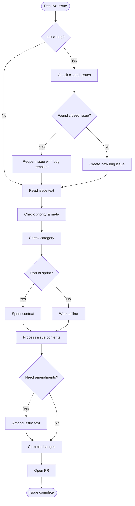

# Issue Workflow

## Bug Fix Process

When handling bugs:

1. First check if this is a regression (bug reappearing) by searching closed issues
2. If a related closed issue exists:
   - Reopen the issue using the bug template
   - Link to the original issue
   - Add any new context or information
3. If no related issue exists:
   - Create a new issue using the bug template
   - Set category to "bugs"
   - Add appropriate tags (bug, fix, critical if needed)
4. Follow normal issue workflow after bug issue is created

## Normal Issue Process

(Rest of existing content...)
