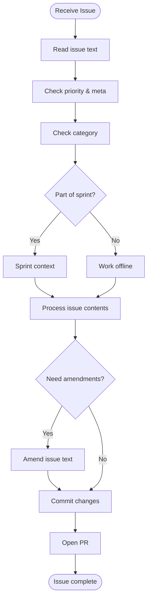

# Issue Workflow

```mermaid
flowchart TD
    start([Receive Issue]) --> read[Read issue text]
    read --> meta[Check priority & meta]
    meta --> category[Check category]
    category --> inSprint{Part of sprint?}
    inSprint -->|Yes| sprint[Sprint context]
    inSprint -->|No| offline[Work offline]
    sprint --> process[Process issue contents]
    offline --> process
    process --> amend{Need amendments?}
    amend -->|Yes| edit[Amend issue text]
    edit --> commit[Commit changes]
    amend -->|No| commit
    commit --> pr[Open PR]
    pr --> done([Issue complete])
```
