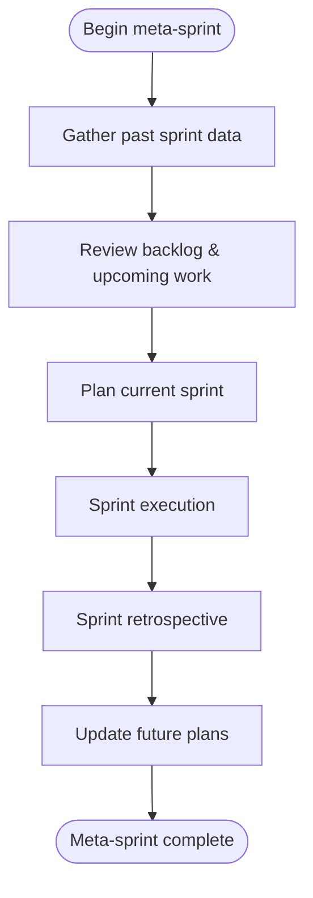

# Meta-Sprint Workflow

```mermaid
flowchart TD
    start([Begin meta-sprint]) --> gather[Gather past sprint data]
    gather --> review[Review backlog & upcoming work]
    review --> plan[Plan current sprint]
    plan --> run[Sprint execution]
    run --> retro[Sprint retrospective]
    retro --> update[Update future plans]
    update --> metaEnd([Meta-sprint complete])
```
