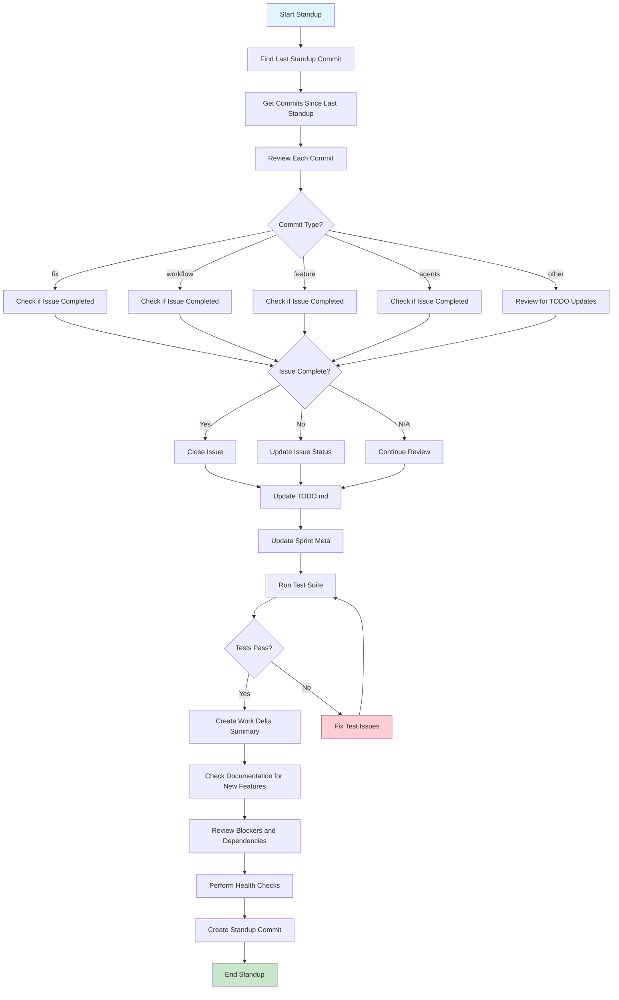

# Standup Workflow

This document describes the detailed process for running a cycle standup in EcoNexyz.

## Overview

A cycle standup synchronizes the repository's planning files with recent work. It's the primary mechanism for:
- Closing completed issues
- Updating TODO.md and sprint metadata
- Ensuring all changes are properly documented
- Maintaining project consistency
- Reviewing blockers and dependencies
- Performing health checks

## Workflow Diagram



## Detailed Steps

### 1. Preparation
```bash
# Ensure you're on main branch and up to date
git checkout main
git pull origin main

# Find the last standup commit
git log --oneline --grep="^\[standup\]" -1
```

### 2. Review Commits Since Last Standup
```bash
# Get all commits since last standup (replace HASH with actual hash)
git --no-pager log --oneline HASH..HEAD
```

### 3. Analyze Each Commit
For each commit, determine:
- **Issue completion**: Does this commit complete an issue?
- **TODO updates needed**: Does this require TODO.md changes?
- **Sprint updates needed**: Does this affect sprint metadata?

### 4. Close Completed Issues
```bash
# Close completed issues
./scripts/close_issue.sh <category> <issue-name>

# Example:
./scripts/close_issue.sh workflow commit_type_refactor_and_guidelines
```

### 5. Update TODO.md
Manually update `TODO.md`:
- Mark completed issues with `[x]`
- Add new issues with `[ ]`
- Update issue descriptions if needed
- Add blocker annotations

### 6. Update Sprint Metadata
Update current sprint's `sprint-meta.md`:
- Mark completed issues as done
- Add new issues to sprint
- Update sprint progress

### 7. Run Test Suite
```bash
# Run all tests to ensure changes don't break anything
./scripts/run_all_tests.sh
```

### 8. Create Work Delta Summary
Document the work completed since the last standup:
- List all completed issues with brief descriptions
- Note any new features or significant changes
- Document any architectural decisions made
- Include metrics (lines of code, files changed, etc.)

### 9. Check Documentation for New Features
Review and ensure documentation is updated for new features:
- Check if new scripts have usage documentation
- Verify new workflows are documented in `docs/workflows/`
- Ensure new APIs or interfaces are documented
- Update README.md if new functionality was added
- Check that commit message templates are current

### 10. Review Blockers and Dependencies
Identify and address any blocking issues:
- List any issues marked as `blocked` or with blocker tags
- Review dependencies between issues
- Identify unassigned work that might be blocking progress
- Check for aging issues that haven't been updated recently
- Document any new blockers discovered during development

### 11. Perform Health Checks
Run comprehensive health checks on the repository:
```bash
# Run all tests
./scripts/run_all_tests.sh

# Check for linting issues (if applicable)
# python -m flake8 .  # or equivalent

# Verify git hooks are working
python scripts/test_commit_hook.py

# Check for any broken links in documentation
# (if you have a link checker)

# Verify all scripts are executable
find scripts/ -name "*.sh" -exec test -x {} \;
```

### 12. Create Standup Commit
```bash
# Generate standup commit message
python scripts/run_standup.py --generate-commit

# Review and edit the generated message, then commit
git add .
git commit -F /tmp/standup_commit.txt
```

## Commit Message Template

Use the standup template to document:
- Issues closed
- Issues added
- TODO.md updates
- Sprint meta updates
- Work delta summary
- Documentation updates
- Blocker review findings
- Health check results

Example:
```
[standup] Cycle standup summary

# Summary of stand-up activities
# 
# - Issues closed:
#   - workflow/commit_type_refactor_and_guidelines
#   - workflow/add_git_hook_setup
# 
# - Issues added:
#   - workflow/create_dao_for_smart_agent_integration
#   - workflow/add_issue_to_sprint_script
# 
# - Work delta:
#   - Completed 3 workflow improvements
#   - Added standup automation script
#   - Implemented pre-commit hooks
# 
# - Documentation updates:
#   - Updated standup workflow documentation
#   - Added usage examples for new scripts
# 
# - Blocker review:
#   - No new blockers identified
#   - DAO integration still blocked by API access
# 
# - Health checks:
#   - All tests passing
#   - Git hooks working correctly
#   - No linting issues found
```

## Scripts Used

- `git log` - Review commits
- `./scripts/close_issue.sh` - Close completed issues
- `./scripts/run_all_tests.sh` - Run test suite
- `python scripts/run_standup.py` - Generate standup summary
- `python scripts/test_commit_hook.py` - Test git hooks

## Usage Examples

### Basic Standup
```bash
# Run a basic standup analysis (dry run)
python scripts/run_standup.py --dry-run

# Generate commit message for manual review
python scripts/run_standup.py --generate-commit
```

### Enhanced Standup with All Features
```bash
# Run all enhanced standup features
python scripts/run_standup.py --all
```

### Individual Feature Usage
```bash
# Create work delta summary only
python scripts/run_standup.py --work-delta

# Check documentation for new features
python scripts/run_standup.py --check-docs

# Review blockers and dependencies
python scripts/run_standup.py --review-blockers

# Perform health checks
python scripts/run_standup.py --health-check
```

### Combined Usage
```bash
# Traditional standup with enhanced features
python scripts/run_standup.py --dry-run --all

# Generate commit message with all checks
python scripts/run_standup.py --generate-commit --all

# Quick health check without full analysis
python scripts/run_standup.py --health-check --dry-run
```

### Command Line Options
- `--dry-run`: Show what would be done without making changes
- `--generate-commit`: Generate standup commit message
- `--work-delta`: Create work delta summary
- `--check-docs`: Check documentation for new features
- `--review-blockers`: Review blockers and dependencies
- `--health-check`: Perform health checks
- `--all`: Run all enhanced standup steps

## Best Practices

1. **Run standups regularly**: At least once per development cycle
2. **Be thorough**: Review every commit, not just obvious ones
3. **Test everything**: Always run tests before committing
4. **Document clearly**: Use detailed commit messages
5. **Keep it atomic**: One standup commit per cycle
6. **Check documentation**: Ensure new features are properly documented
7. **Review blockers**: Don't let issues get stuck
8. **Maintain health**: Keep the codebase in good condition

## Common Patterns

### Issue Completion Detection
- `[fix]` commits often complete bug issues
- `[workflow]` commits often complete workflow issues
- `[agents]` commits often complete agent-related issues
- Look for commit messages that reference specific issues

### TODO.md Updates
- Mark completed issues with `[x]`
- Add new issues discovered during development
- Update issue descriptions for clarity
- Add blocker annotations for dependencies

### Sprint Updates
- Move completed issues to closed section
- Add new issues to appropriate sprints
- Update sprint progress percentages
- Reorder issues by priority if needed

### Documentation Checks
- New scripts should have usage examples
- New workflows should be documented
- API changes should update relevant docs
- README should reflect current state

### Blocker Review
- Check for issues marked as blocked
- Review dependencies between tasks
- Identify unassigned work
- Flag aging issues for attention

### Health Checks
- All tests must pass
- Git hooks should work correctly
- No obvious code quality issues
- Documentation should be current

## Troubleshooting

### Test Failures
If tests fail during standup:
1. Identify the failing test
2. Check if it's related to recent changes
3. Fix the issue or revert problematic changes
4. Re-run tests before proceeding

### Merge Conflicts
If TODO.md or sprint files have conflicts:
1. Resolve conflicts manually
2. Ensure all changes are preserved
3. Test the resolved state
4. Continue with standup process

### Missing Issues
If commits reference issues not in TODO.md:
1. Create the missing issue
2. Add it to appropriate sprint
3. Update TODO.md
4. Document in standup commit

### Documentation Gaps
If new features lack documentation:
1. Create basic documentation immediately
2. Add to TODO.md for follow-up
3. Consider blocking the feature until documented
4. Update relevant guides and README

### Blocker Issues
If blockers are identified:
1. Document the blocker clearly
2. Assign ownership if possible
3. Create follow-up tasks to resolve
4. Consider workarounds or alternative approaches 